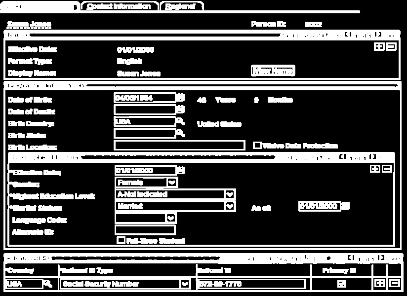
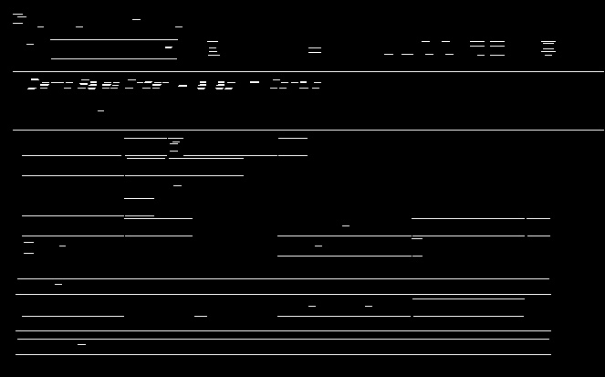
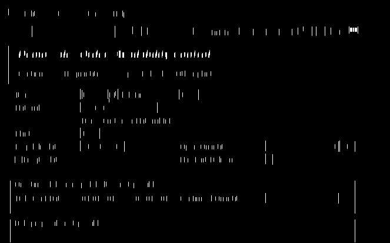
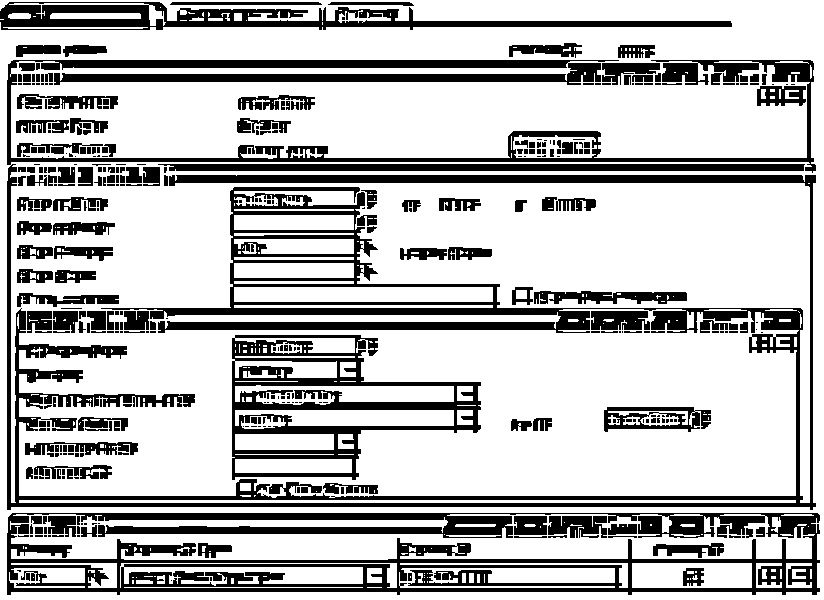
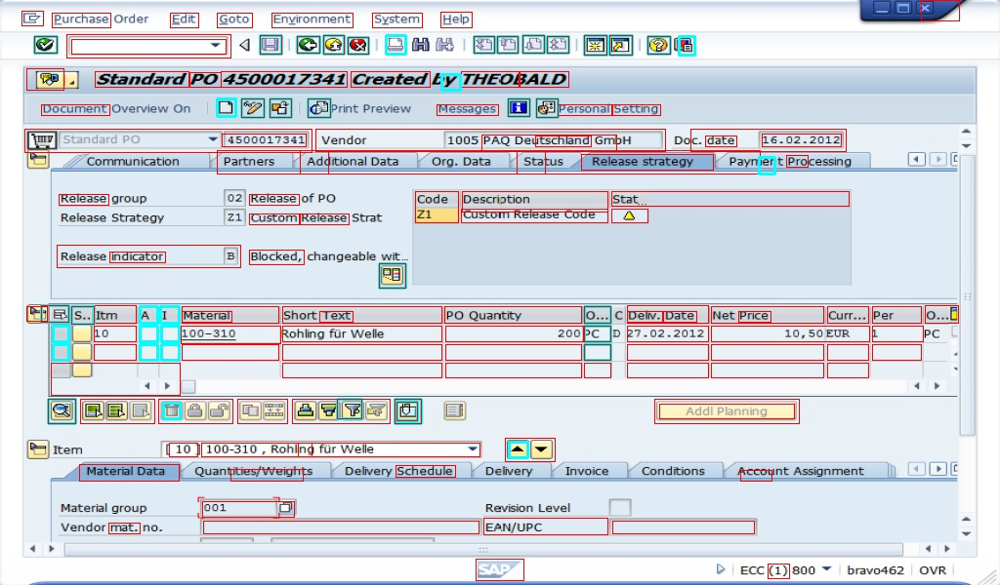

# UI Elements Recognition
This repo is about detection and recogniton of UI elements of SAP interface
- [x] Detection
- [ ] Recognition

## Method<br>
### 1. Binarization of input<br>
binarizing input image using *adaptive Gaussian filter*
<br>

<br>
### 2. Creating Image for contour detection<br>
>#### 2.1 horizontol lines<br>
 <br>
>#### 2.2 Verticle lines  <br>
<br>
>#### 2.3 Add horizontol and verticls lines to get full image 
<br><br>

### 3. Detection and Localization of contours<br>

** Dimensions of the contours are controlled by:<br>
> w = width<br>
> h = depth <br>
```
 if (w < 30 and h>15 and w>15 and h < 30):
 if (w > 20 and h > 10) and w<450 and h<40:
```

<br>
